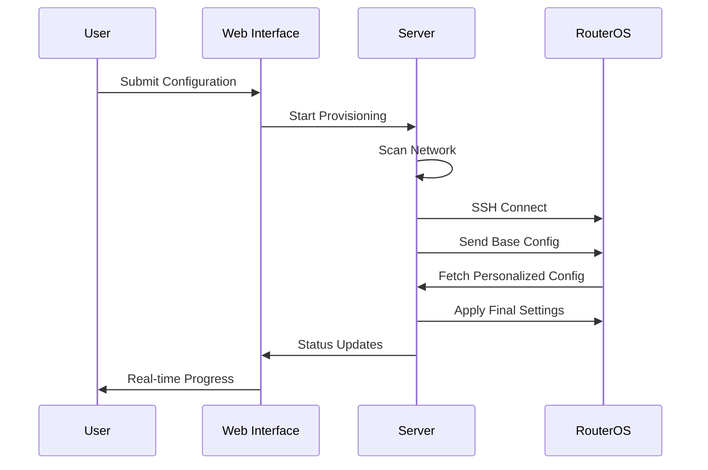

# Mikrotik RouterBoard Provisioner

A client-side Flask web application for automated Mikrotik RouterBoard provisioning and configuration. This application runs on a Linux workstation and provides a simple web interface to configure RouterOS devices with customized settings including PPPoE, LAN configuration, WiFi, VLANs, and more.


## 🚀 Features

### Core Functionality
- **Client-side Operation**: Runs on technician's Linux workstation
- **Direct Connection**: Connect directly to RouterOS device for provisioning
- **Web-based Interface**: Simple HTML form for entering router configuration parameters
- **Network Discovery**: Automatic MAC address to IP resolution using arp-scan
- **SSH Automation**: Secure connection to RouterOS devices using paramiko
- **Configuration Generation**: Dynamic RouterOS script (.rsc) generation
- **Real-time Status**: Live provisioning updates using Server-Sent Events
- **Portable Setup**: No server infrastructure required

### Supported Configuration
- **Network Settings**: LAN IP configuration with DHCP server setup
- **Internet Connection**: PPPoE client configuration
- **WiFi Setup**: Wireless network configuration (for devices with WiFi)
- **VLAN Configuration**: Multiple VLAN support
- **Firewall Rules**: Basic security configuration
- **Quality of Service**: Bandwidth limitation
- **Port Forwarding**: NAT rule configuration
- **System Settings**: Identity, time zone, DNS, NTP

### Advanced Features
- **In-memory Storage**: No database required, perfect for lightweight deployments
- **Error Handling**: Comprehensive error handling and logging
- **Session Management**: Track multiple provisioning sessions
- **Configuration Persistence**: Generated configurations stored for reference
- **Background Processing**: Non-blocking provisioning workflow

## 🏗️ Architecture

```
┌─────────────────┐    ┌──────────────────┐    ┌─────────────────┐
│ Linux Workstation│    │  Flask App       │    │  RouterOS       │
│                 │    │  (localhost:5000)│    │  Device         │
│  - Technician   │◄──►│                  │◄──►│                 │
│  - Web Browser  │    │  - Network Scan  │    │  - SSH Access   │
│  - Direct Conn  │    │  - SSH Commands  │    │  - Config Apply │
│                 │    │  - Config Gen    │    │  - Auto Setup   │
└─────────────────┘    └──────────────────┘    └─────────────────┘
```

### Typical Workflow
1. **Connect** Linux workstation to RouterOS device via Ethernet
2. **Start** provisioning application on workstation
3. **Access** web interface at `http://localhost:5000`
4. **Configure** router parameters via web form
5. **Provision** router automatically via SSH
6. **Disconnect** and deploy configured router

### Component Overview
- **Network Discovery Module**: MAC address resolution and network scanning
- **SSH Operations Module**: RouterOS device communication and command execution
- **Configuration Generator**: Dynamic RouterOS script creation
- **Status Manager**: Real-time provisioning status tracking
- **Web Interface**: HTML/CSS/JavaScript frontend with real-time updates

## 📋 Prerequisites

### System Requirements
- **Operating System**: Linux (Ubuntu, Debian, Linux Mint, etc.)
- **Python**: 3.11 or higher
- **Network Tools**: arp-scan
- **SSH**: OpenSSH client

### Network Requirements
- Direct Ethernet connection between workstation and RouterOS device
- RouterOS devices with default admin access or known SSH credentials
- TCP port 5000 available locally for web interface

## 🛠️ Installation

### Quick Installation for Production (Recommended)

For junior technicians and production use:

1. **Download and extract** the application
2. **Run the simple installer**:
   ```bash
   cd mktk-provisioner
   chmod +x install-simple.sh
   ./install-simple.sh
   ```
3. **Start the application**:
   ```bash
   mktk-provisioner
   ```
4. **Access web interface**: `http://localhost:5000`

### Development Installation

For development and testing:

1. **Clone the repository**:
   ```bash
   git clone <repository-url>
   cd mktk-provisioner
   ```

2. **Create virtual environment**:
   ```bash
   python3 -m venv venv
   source venv/bin/activate
   pip install -r requirements.txt
   ```

3. **Run the application**:
   ```bash
   python app.py
   ```

### Quick Run (No Installation)

For testing without installation:

```bash
cd mktk-provisioner
chmod +x run.sh
./run.sh
```

## 🔧 Usage

### Basic Setup

1. **Access the web interface** at `http://localhost:5000`

2. **Fill in the provisioning form**:
   - **Router MAC Address** (required): MAC address of the target router
   - **SSH Password** (optional): Leave empty for default RouterOS access
   - **LAN IP Address**: Desired LAN IP with subnet (e.g., `192.168.1.1/24`)
   - **PPPoE Credentials**: ISP username and password

3. **Advanced Options** (expandable):
   - **WiFi Configuration**: SSID and password for wireless networks
   - **VLAN Setup**: Comma-separated VLAN IDs
   - **Bandwidth Limiting**: Total bandwidth limits
   - **Port Forwarding**: NAT rules for port forwarding

### RouterOS Device Preparation

Ensure your RouterOS devices are in a default or known state:

- **Default Configuration**: Fresh RouterOS installation
- **Direct Connection**: Device connected directly to workstation via Ethernet
- **SSH Access**: Either default (no password) or known credentials
- **MAC Address**: Note the MAC address of the WAN interface (usually ether1)

### Provisioning Process

1. **Connect the RouterOS device** directly to your workstation via Ethernet cable
2. **Start the application** using one of the installation methods above
3. **Open your browser** to `http://localhost:5000`
4. **Enter the router details** in the web form
5. **Click "Provision Router"** and monitor the real-time progress
6. **Download configurations** if needed via the `/config/` endpoints

## 📡 How It Works

### Provisioning Workflow

1. **Network Scanning**: Application scans the local network to find the router by MAC address
2. **SSH Connection**: Establishes secure connection to the RouterOS device
3. **Base Configuration**: Sends initial configuration script via SSH
4. **Personalized Setup**: Router automatically fetches device-specific configuration
5. **Final Configuration**: Applies all settings and completes setup

### Configuration Process



## 🔍 Monitoring and Troubleshooting

### Service Management

```bash
# Check service status
sudo systemctl status mktk-provisioner

# View logs
sudo journalctl -u mktk-provisioner -f

# Restart service
sudo systemctl restart mktk-provisioner

# Stop service
sudo systemctl stop mktk-provisioner
```

### Log Files

- **Application Logs**: `provisioner.log` in the application directory
- **System Logs**: Available via `journalctl -u mktk-provisioner`

### Common Issues

1. **Router Not Found**:
   - Verify MAC address format
   - Ensure router is on the same network
   - Check arp-scan functionality: `arp-scan --local`

2. **SSH Connection Failed**:
   - Verify SSH credentials
   - Check if RouterOS has SSH enabled
   - Ensure firewall allows SSH (port 22)

3. **Configuration Not Applied**:
   - Check RouterOS logs: `/log print`
   - Verify HTTP access to server from router
   - Check generated configuration files

### Testing Network Discovery

```bash
# Test arp-scan functionality
arp-scan --local --plain

# Check if specific MAC is visible
arp-scan --local | grep "AA:BB:CC:DD:EE:FF"
```

## 🔒 Security Considerations

### Network Security
- **Firewall**: Configure firewall to restrict access to port 5000
- **Network Isolation**: Run on isolated management network if possible
- **SSH Keys**: Consider using SSH keys instead of passwords for production

### Application Security
- **HTTPS**: Add reverse proxy with SSL for production use
- **Authentication**: Add user authentication for multi-user environments
- **Logging**: Monitor access logs for suspicious activity

### RouterOS Security
- **Change Default Passwords**: Always change default RouterOS passwords
- **Disable Unused Services**: Disable unnecessary RouterOS services
- **Regular Updates**: Keep RouterOS updated to latest version

## 🔄 API Reference

### Provisioning Endpoints

- **POST /provision**: Start router provisioning
- **GET /status/<session_id>**: Get provisioning status
- **GET /status/stream/<session_id>**: Real-time status stream

### Configuration Endpoints

- **GET /config/base.rsc**: Base RouterOS configuration
- **GET /config/<mac_address>.rsc**: Personalized configuration

### Management Endpoints

- **GET /sessions**: List all provisioning sessions

## 🛠️ Development

### Project Structure

```
mktk-provisioner/
├── app.py                 # Main Flask application
├── requirements.txt       # Python dependencies
├── install.sh            # Installation script
├── mktk-provisioner.service # Systemd service file
├── modules/              # Application modules
│   ├── network_discovery.py
│   ├── ssh_operations.py
│   ├── config_generator.py
│   └── status_manager.py
├── templates/            # HTML templates
│   └── index.html
├── configs/              # Generated configurations
└── .github/
    └── copilot-instructions.md
```

### Adding New Parameters

1. **Update HTML Form**: Add new input fields in `templates/index.html`
2. **Modify Config Generator**: Add parameter handling in `config_generator.py`
3. **Update RouterOS Script**: Modify configuration template
4. **Test Configuration**: Verify with test RouterOS device

### Running in Development Mode

#### Option 1: VS Code (Recommended for Development)

1. **Open in VS Code**:
   ```bash
   code /path/to/mktk-provisioner
   ```

2. **Install dependencies** using the VS Code task:
   - Press `Ctrl+Shift+P` (or `Cmd+Shift+P` on Mac)
   - Type "Tasks: Run Task"
   - Select "Install Dependencies"

3. **Run the application**:
   - Press `Ctrl+Shift+P` (or `Cmd+Shift+P` on Mac)
   - Type "Tasks: Run Task" 
   - Select "Run Mikrotik Provisioner"
   - Or press `Ctrl+Shift+D` and select "Run Mikrotik Provisioner"

4. **Access the application** at `http://localhost:5000`

#### Option 2: Command Line

```bash
# Install dependencies
python3 -m pip install -r requirements.txt

# Set Flask environment
export FLASK_ENV=development

# Run application
python3 app.py
```

#### Option 3: Virtual Environment

```bash
# Create and activate virtual environment
python3 -m venv venv
source venv/bin/activate

# Install dependencies
pip install -r requirements.txt

# Run application
python app.py
```

## 📚 RouterOS Configuration Reference

### Generated Configuration Files

The application generates two types of RouterOS configurations:

1. **Base Configuration** (`base.rsc`):
   - Basic system setup
   - Network interfaces
   - Security rules
   - Script to fetch personalized config

2. **Personalized Configuration** (`<mac>.rsc`):
   - Device-specific settings
   - PPPoE credentials
   - LAN IP configuration
   - Custom parameters

### RouterOS Script Syntax

The generated scripts use standard RouterOS CLI syntax:

```routeros
# Set system identity
/system identity set name="RouterBoard-Example"

# Configure PPPoE
/interface pppoe-client add name=pppoe-out interface=ether1 user="username" password="password"

# Set LAN IP
/ip address add address=192.168.1.1/24 interface=bridge-local
```

## 🤝 Contributing

1. **Fork the repository**
2. **Create a feature branch**: `git checkout -b feature/new-feature`
3. **Make changes and test**
4. **Commit changes**: `git commit -am 'Add new feature'`
5. **Push to branch**: `git push origin feature/new-feature`
6. **Create Pull Request**

### Development Guidelines

- Follow RouterOS script syntax for .rsc files
- Handle network and SSH errors gracefully
- Use proper logging throughout the application
- Keep the code modular and extensible
- Test with actual RouterOS devices when possible

## 📄 License

This project is licensed under the MIT License - see the LICENSE file for details.

## 🆘 Support

### Getting Help

- **Issues**: Report bugs or request features via GitHub Issues
- **Documentation**: Check this README and inline code comments
- **Community**: Join discussions in the project repository

### Useful Resources

- [RouterOS Documentation](https://help.mikrotik.com/)
- [RouterOS Scripting](https://help.mikrotik.com/docs/display/ROS/Scripting)
- [Flask Documentation](https://flask.palletsprojects.com/)
- [Paramiko Documentation](https://docs.paramiko.org/)

## 🙏 Acknowledgments

- **Mikrotik**: For creating RouterOS and providing excellent documentation
- **Flask Community**: For the web framework
- **Paramiko Developers**: For SSH library
- **Open Source Community**: For various tools and libraries used

---

**Made with ❤️ for network automation enthusiasts**
